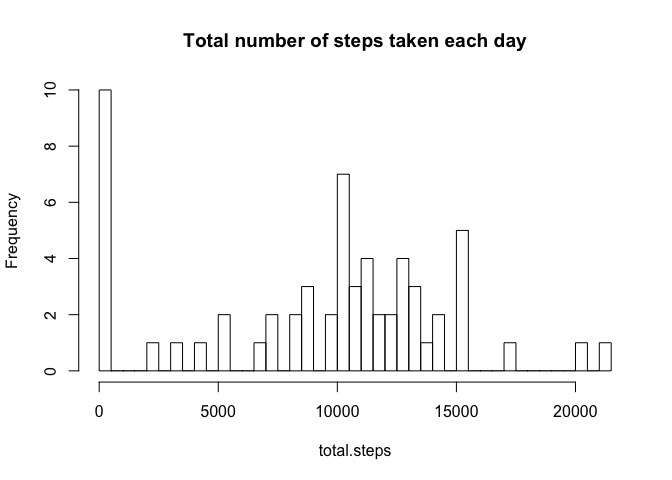
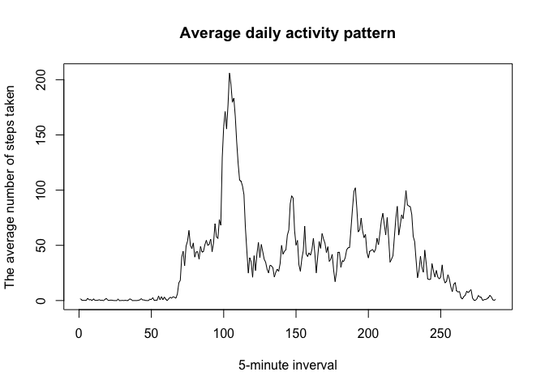
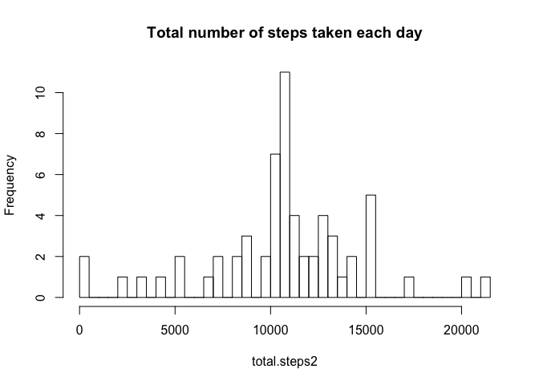

# Reproducible Research: Peer Assessment 1

## Basic settings


```r
echo = TRUE 
options(scipen = 1) 
```

## Loading and preprocessing the data


```r
unzip(zipfile="activity.zip")
dat <- read.csv("activity.csv")
```

## What is mean total number of steps taken per day?


```r
total.steps <- tapply(dat$steps, dat$date, FUN = sum, na.rm = T)
hist(total.steps, breaks = length(total.steps), main = "Total number of steps taken each day")
```

 

```r
m1 <- round( mean(total.steps, na.rm = T), 0)
m2 <- round( median(total.steps, na.rm = T), 0)
```
* Mean = 9354  
* Median = 10395

## What is the average daily activity pattern?


```r
avg.steps <- tapply(dat$steps, dat$interval, FUN = mean, na.rm = T)
plot(avg.steps,
     type = "l",
     xlab = "5-minute inverval",
     ylab = "The average number of steps taken",
     main = "Average daily activity pattern")
```

 

```r
m3 <- which.max(avg.steps)
```
* Which 5-minute interval, on average across all the days in the dataset, contains the maximum number of steps?  
104 interval


## Imputing missing values


```r
m4 <- nrow(dat[is.na(dat$steps),])
```
* Number of rows containing missing values: 2304

* Imputing missing values
Replace each missing value with the mean value of its 5-minute interval


```r
dat2 <- dat

for ( i in 1:nrow(dat2)){
        if (is.na(dat2$steps[i])){
                dat2$steps[i] = avg.steps[as.character(dat$interval[i])]
        }
}
```

* Total number of steps taken each day

```r
total.steps2 <- tapply(dat2$steps, dat2$date, FUN = sum)
hist(total.steps2, breaks = length(total.steps2), main = "Total number of steps taken each day")
```

 

```r
m5 <- round( mean(total.steps2), 0)
m6 <- round( median(total.steps2), 0)
```
* Mean = 10766  
* Median = 10766
* These values are greater than the estimates from the first part of the assignment
* Imputing missing data inflate the estimates of the total daily number of steps

## Are there differences in activity patterns between weekdays and weekends?


```r
dat2$day <- weekdays(as.Date(dat2$date))
dat2$day[dat2$day %in% c("Monday", "Tuesday", "Wednesday", "Thursday", "Friday")] <- "weekday"
dat2$day[dat2$day %in% c("Saturday", "Sunday")] <- "weekend"
dat2$day <- factor(dat2$day)

dat.weekday <- dat2[dat2$day == "weekday",]
dat.weekend <- dat2[dat2$day == "weekend",]

avg.weekday <- tapply(dat.weekday$steps, dat.weekday$interval, FUN = mean, na.rm = T)
avg.weekend <- tapply(dat.weekend$steps, dat.weekend$interval, FUN = mean, na.rm = T)

dat3.1 <- data.frame(as.vector(avg.weekday), as.numeric(names(avg.weekday)), "weekday")
dat3.2 <- data.frame(as.vector(avg.weekend), as.numeric(names(avg.weekend)), "weekend")

names(dat3.1) <- names(dat3.2) <- c("steps", "interval", "day")
dat3 <- rbind(dat3.1, dat3.2)


library(lattice)
xyplot(steps ~ interval | day, data = dat3, 
       layout = c(1, 2),
       type = "l",
       ylab = "Number of steps")
```

 

* There are differences in activity patterns between weekdays and weekends
